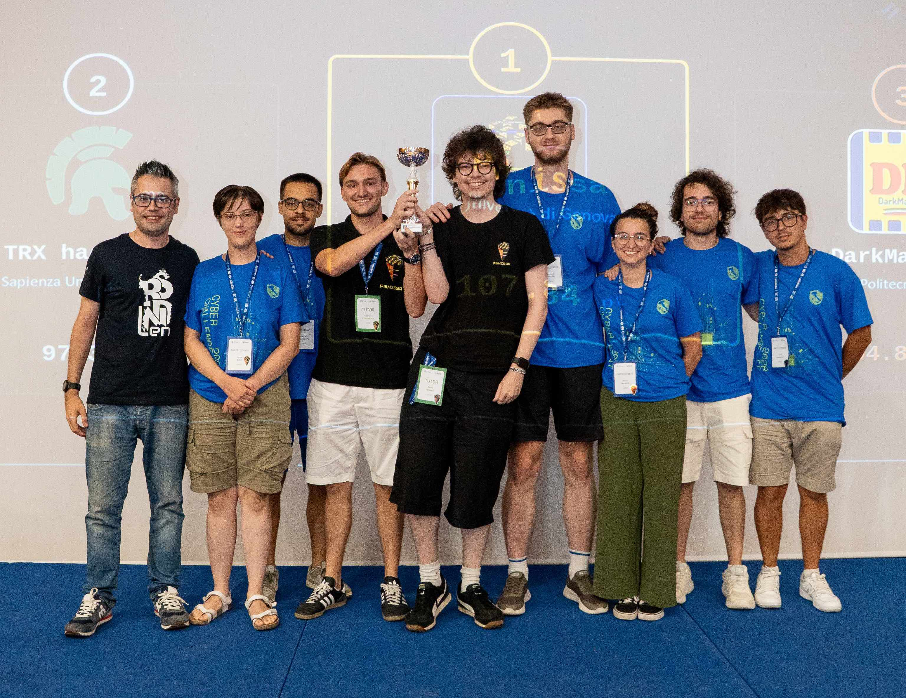
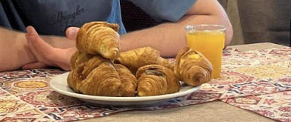
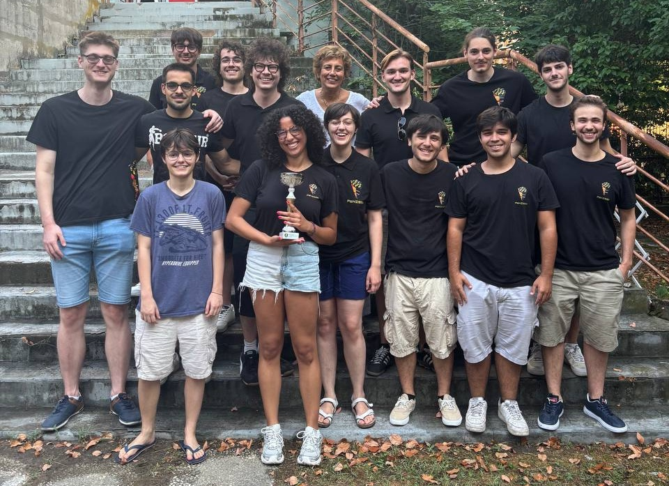

import Callout from '../../../components/Callout.astro';

A few days ago, at the Grand Hotel in Salerno, **we picked up a trophy** 🏆. Pwnissa won first place in the Junior section of [CyberCup.it](https://cybercup.it). Not bad for a team that didn't even exist a year ago. 

## What is CyberCup? 

[CyberCup.it](https://cybercup.it) is the tournament that brings together Italian CTF teams. This edition had 6 rounds, with every solved challenge adding points to the total score. 

There are two leaderboards, Standard and Junior, but every team plays the exact same games and solves the same challenges. Since you can only do [CyberChallenge.it](https://cyberchallenge.it) once as a university student, CyberCup was created **to allow people to continue playing CTFs**. We want to say a big thank you to the organizers for putting this tournament together. 

 

## The experience in Salerno 

Our CyberCup trophy was handed to us during the award ceremony of CyberChallenge.it 2026 national finals in July. 

It was a huge event: **over 40 universities** and more than **240 students**, accompanied by 1 or 2 tutors for each team, from all over Italy gathered in Salerno. Genoa was represented by a team of 6 students, selected from 20 participants who went through the training path between February and May at UniGe accompanied by two tutors from Pwnissa. 

The national finals were intense. It was a 4-day event built around an Attack & Defense CTF. Between testing the network on the first night, the main game day, the service presentations by the top teams, and the recruitment fair with sponsor companies, the energy was incredible.  

For us tutors, it was super useful and rewarding to chat with tutors from top Italian teams and exchange ideas. It was amazing to see how many people **already recognized us as the Genoa team!** We also loved talking to participants who want to build a CTF team at their own university and asked us how we got started. **We wish them all the best!**

Being right by the sea in Salerno, surrounded by hundreds of people who share the same passion, made it an unforgettable experience. The pressure during the match was real, but making new friends and feeling that atmosphere made it completely worth it. (Special mention to one of our team members who somehow managed to crush 8 croissants  at breakfast to fuel up for the game!)

 
## Building a Team from Scratch  

Pwnissa started in the summer of 2025. We were just a few UniGe students who had finished CyberChallenge and wanted to keep playing together. But we soon realized that **if we wanted a proper team in Genoa, we had to build it ourselves from the ground up.**

Over the past year, we: 
- Built our own website and **CTF platform.**
- Wrote more than **70 original challenges** across Web, Crypto, Reverse, Network, and Pwn. 
- Created an **11-lesson Academy** in Italian, which had over 60 students signed up. 
- Taught a **3-day condensed version** of our Academy at the University of Podgorica in Montenegro. 
- Got ourselves stickers, team shirts, and trained a plush horse mascot named Pwny for incredibile races! 

More than anything, we created an identity for the Genoa CTF scene. We want Pwnissa to be something that lasts long after we graduate, passed down from one group of students to the next. 

## What Really Matters to Us 

Winning the Junior trophy was an **incredible milestone** for us but looking back at this year, what makes us just as proud is the community that grew around Pwnissa. Today, about **30 people** now hang out with us, and **more than half** of them actively play CTFs. We didn't build this group with mandatory meetings or strict rules. It just happened over post-lesson drinks, pizza, and late-night walks through the narrow alleys of Genoa's center (cybervicolate). 

We wanted a team where everyone feels useful and welcome, even if we are all still beginners. Passion matters much more than experience. 

## What's Next?  

The hard part starts now: keeping all of this going while getting better at what we do.  

We are bringing in the new participants from CyberChallenge 2026, getting ready for the next round of our Academy, and taking on harder CTFs.  

  

If you study at UniGe, if you are a “Ligure” interested in cybersecurity, or just want to see what this is about, you're always welcome to join our next Academy session. No background needed, just bring your curiosity and maybe a laptop, we'll handle the rest! 

👉 [Participation Form](https://forms.gle/uCkKRjq3B861tLRx9)