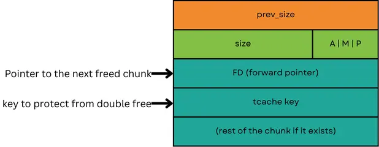
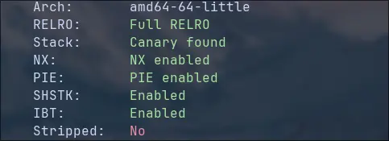
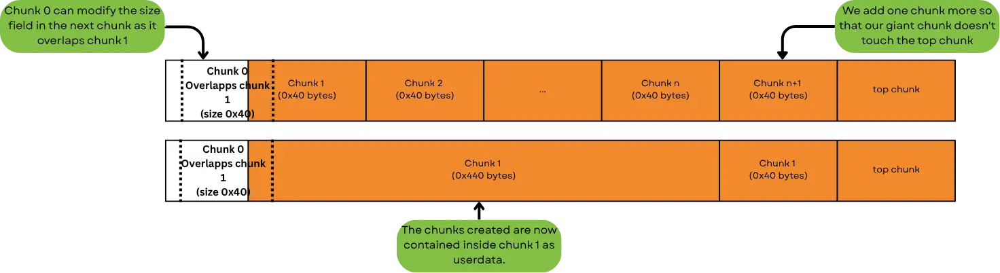
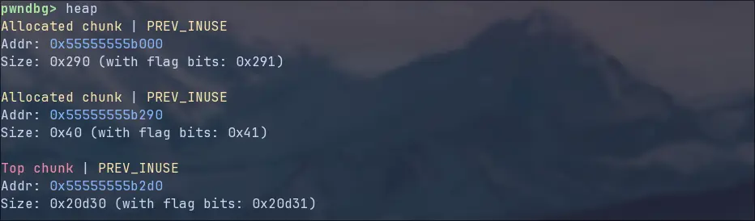
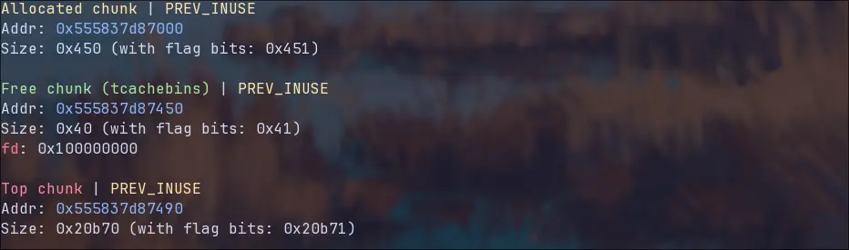
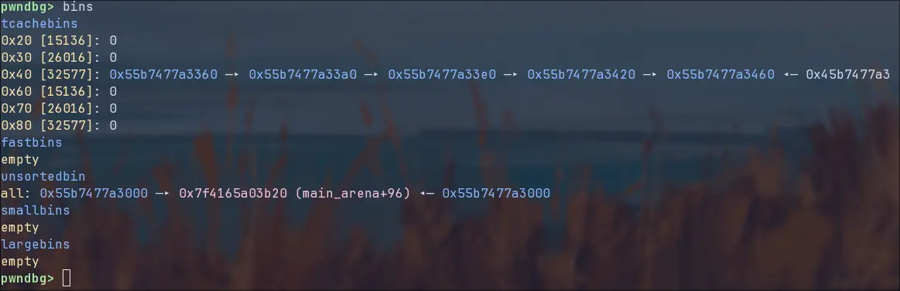

import Callout from '../../../components/Callout.astro';

Normally, especially for beginners, seeing a baby challenge is always a very refreshing alternative to the high level tasks made to challenge also the best of players.

You solve a very simple challenge and have the possibility to encounter a new technique in a simple and protected setting. Baby heap breaks one of these assumptions, to be fair, it was never written which type of _baby_ is intended in the title, a newborn beluga whale for example can weight even $100$kg, enough to crush my sanity.

By the end of this write-up, I hope you’ll understand both my frustration and my realization: maybe my assumptions about baby challenges were wrong from the start. In fact, I learned more about `libc` internals and exploitation techniques in this single challenge than in all the other “baby” ones combined.

This is a two-part journey: from simple heap exploitation to advanced techniques, and finally, as dessert, an `exit_function` overwrite and `environ` leak.

# The disassembly
As usual, we are not going to look at the entire binary, but instead focusing on the relevant parts. For context, the program is straightforward:

- `create_chunk()` Allocates a buffer of size `0x30`.
- `modify_chunk()` Allows you to overwrite the contents of an existing chunk.
- `read_chunk()` Reads the full `0x30` bytes from a chunk.
- `delete_chunk()` Frees the chunk.

We are gonna concentrate on two of these functions:

```c
//babyheap
int create_chunk()
{
  int index; // [rsp+Ch] [rbp-4h]

  index = get_index();
  if ( *((_QWORD *)&chunks + index) )
	return puts("This index is already in use");
  *((_QWORD *)&chunks + index) = malloc(0x30uLL);
  printf("Content? ");
  printf("Content? "); //wtf why?
  return read(0, *((void **)&chunks + index), 0x30uLL);
}
```

As described above, this function creates a chunk and saves the address to an array of max $20$ entries, if the entry is occupied it returns without allocating and gives an error message.

```c
//babyheap
void delete_chunk()
{
  int index; // [rsp+Ch] [rbp-4h]

  index = get_index();
  if ( *((_QWORD *)&chunks + index) )
    free(*((void **)&chunks + index));
  else
    puts("This chunk is empty");
}
```

Looking at the `delete_chunk()`function we notice that it doesn't remove the address from the array once deleted. This has a few implications, _first_ it is possible to read and write to a freed chunk, and _second_, once created a chunk you cannot call a second time `create_chunk()` on the same index, this limits our `create_chunk()` calls to maximum 20.

# Heap Exploitation

<Callout type="warning">
**Heap exploitation** is a complex topic, so I won’t go too deep here. If you are interested here is a link to some [material](https://5o1z.github.io/blog/heapexploitation/getting_started/).
</Callout>

When `malloc()` is called, generally, a memory address to the heap is returned, this address points to the user data of a struct, the sections above contain important metadata. We like to call this memory areas chunks.


**From now one we will consider the header part of the chunk, so it’s size becomes 0x40 instead of 0x30.**
Looking at the chunks header, we notice a few significant fields: The size field stores the amount of bytes that divide this chunk from the next one, yet nothing stops us from writing more bytes than the amount specified in the size field. 
Another interesting part is the P flag, if `prev_used` is set, free() knows that the previous chunk is currently allocated, if the flag isn't set, the allocator could try to fuse together the two chunks to create a bigger one.

## The bins

When a chunk is freed, from `LIBC-2.26` onwards the deallocator first tries to place an address pointing to the user data as the first element of a per-size-class singly linked list called the **tcache**, which can hold up to 7 elements in every class of max 0x410 bytes of size. 

In the free operation, the first 0x10 bytes of the user data are overwritten with a pointer to the next chunk in the list (fd) and a random value called tcache key used to prevent double frees (not to be confused with the tcache **mangling** key explained later in this chapter). This means that when a freed chunk is read, you won't read the content it stored before but a pointer to a previously freed chunk or, if this is the first freed chunk, a null pointer. 



If more than 7 chunks of the same size are freed, and the chunk is between `0x20` and `0x80` bytes long, the allocator adds them into the **fastbin**. Fastbins have no limit on the number of chunks they can store, but are limited by the before mentioned size classes, also the fd pointer doesn't point to the next fd pointer but to the prev_size field. 

If the tcache is full and the elements are not compatible with the fastbin size-classes, or in very specific cases when mechanisms trigger _fastbin consolidation_ (foreshadowing), chunks are placed into the **unsortedbin**. From there they can get sorted into **largebins** or **smallbins**.

This last three bins are implemented as doubly-linked circular lists. These have their head stored in the **libc address space**, to be more precise, in the `main_arena`, and because of the circular nature of these lists, the **last** element has a forward (fd) pointer to the head of the list stored in the arena, also because of the double-link, the **first** element has a backwards pointer (bk) to it too. So by reading a freed chunk in these bins you can receive a libc leak.

## tcache poisoning

If this binary had **Partial RELRO** and was **non-PIE**, we could have allocated two chunks and then freed them.  
Once freed, both chunks would be placed into the `tcache` linked list, and where their data once resides, pointers to the next chunk in the linked list would now be written. By modifying the last freed chunk’s forward pointer (first element in the tcache list) to point to something like the GOT, the allocator would think that the first deallocated chunk (second element in the tcache) is stored in the GOT table.

<Callout type="warning">
From `LIBC-2.32` The forward pointer (`fd`) addresses saved in the freed tcache entries are **encoded** (mangled). 
```c 
//libc internals
#define PROTECT_PTR(pos, ptr) \
  ((__typeof (ptr)) ((((size_t) pos) >> 12) ^ ((size_t) ptr)))
#define REVEAL_PTR(ptr)  PROTECT_PTR (&ptr, ptr)
```
The macro takes as input the position where the pointer is saved and the location where the pointer is pointing too. 

It then shifts away the 12 least significant bits of the position value, a memory page is generaly 0x1000 (16 bits) long, so we are removing the information about page internal positioning, leaving only the **page address**. In other words two chunks in the same page will have the same `((size_t) pos) >> 12)` value.
It then xores this value with the pointer to mangle it.

This ensures that the _encoded value depends both on the pointer and on the page where it is stored_. Pointers stored in different pages will be mangled differently, even if they point to the same target.

By doing the same operatin again we can reveal the pointer.

But this encoding is easily reversed, the page address used for mangling is part of the address itself, so this algorithm could be defined as a deterministic scramble. Xoring the mangled pointer with shifted parts of itself completly decodes the pointer.

```python
def demangle_alone(ptr,page_offset=0):
	mid = ptr ^ ((ptr>>12)+page_offset)
  	return mid ^ (mid>>24)
```
</Callout>
Then, by reallocating the two chunks, the allocator would return the address of the GOT as the second allocation (the first 16 bytes get zeroed out, look at the note below), we could then:

1. **Read** from the GOT by reading from the second chunk to leak a libc address, but this only works with ‘fwrite()’ or similar because the first 0x10 bytes are null pointers terminating ‘printf’ or ‘puts’ instantly.
2. **Overwrite** a GOT entry (`free`) with the address of `system()`, giving us a shell the next time that function is called.

<Callout type="info">
From `LIBC-2.29` after the 8 byte fd pointer saved in the chunk, another 8 bytes get used to store the **tcache key**, these **16 bytes get zeroed out** when a chunk gets allocated. If this tcache key is present when a free operation is done, that tcache bin gets checked for a double free, else no check is done.
</Callout>
But that’s not the case here… behold:



Still, this very simple technique called **tcache poisoning** will prove useful several times throughout this writeup.

But let’s exit this hypothetical scenario and focus on the real limitations we face: the binary has **no apparent address leak** and **no buffer overflow**, we need to take control in some other way.  

# The Plan
Our actual goal is to gain **arbitrary read and write primitives within libc**. With these, we can leak crucial pointers like `__envrion`, `__exit_functions` or other stuff, and eventually get to a shell.
At this point, it’s worth clarifying that I didn’t solve this challenge during the competition itself. Instead, I studied various writeups to deeply understand the possible solutions and their underlying mechanics.

I’ll present **two** methods to leak a libc pointer, followed by **two** techniques to leverage that leak to achieve a shell. The first leak and exploit can be found in this part, the second part includes a more exotic variant.

# House of something
As explained in the heap primer, the heads of the linked lists for `smallbin`, `largebin`, and `unsortedbin` live in `main_arena` inside libc. Those lists are doubly linked and circular. If we can move a chunk into one of those bins we can read the `fd` pointer that points back into libc and obtain a libc leak usable later.

Sending a chunk into those bins requires freeing a large enough chunk. The tcache holds chunks up to size `0x410` (inclusive), so we must either create a single chunk larger than `0x410` or free more than seven smaller chunks while avoiding the fastbin path (above 0x80 bytes), we will try to deallocate a 0x410 or greater size chunk.

## Reasoning about chunks
**Question**: By manipulating a chunk’s fd pointer (tcache poisoning) to position the next chunk in the tcache list just above a previously allocated third chunk, is it possible to use the first chunk to alter the size metadata of the second chunk, so that when the third chunk is freed, the allocator interprets its size as 0x420 bytes and moves the chunk into unsortedbin?

In theory, **yes**, but with important caveats. We must have a second chunk immediately after our forged chunk (including it's modified size), in this way when we free the giant chunk it doesn't get trimmed away.  
Targeting a 0x420 size will cross past the current top chunk, so we need to allocate enough intermediate chunks until our _guard chunk_ (the second chunk mentioned before) sits directly after our forged chunk. Only then can freeing the forged chunk make the allocator interpret a 0x420 size and move the chunk to unsortedbin instead of trimming it away, producing the desired libc leak.

To guarantee that an extra chunk is placed immediately behind our forged `0x420` chunk we expand the forged size slightly to `0x440`. Because small chunks are `0x40` bytes, the `0x440` size ensures the forged chunk completely overlaps the final small chunk in that region.



But it's not so simple, with 19 allocations we don't have enough chunks to push the top chunk behind our forged one and also have enough allocations to do some tcache poisoning for our final exploitation. We need another strategy. 

## tcache_perthread_struct
The Tcache has a significant property that the other bins don't have, it is local to a specific thread, if more threads are present in the process, more tcaches are created. To make this work, for every thread a tcache struct called `tcache_perthread_struct` is allocated that contains the heads of the linked lists and the number of freed chunks. For our primary thread the 0x290 bytes long perthread_struct is allocated at the top.

```c
//glibc internals https://elixir.bootlin.com/glibc/glibc-2.42/source/malloc/malloc.c#L3127
typedef struct tcache_perthread_struct
{
  uint16_t num_slots[TCACHE_MAX_BINS];
  tcache_entry *entries[TCACHE_MAX_BINS];
} tcache_perthread_struct;
```

By using the `heap` command in pwndbg we can spot the perthread chunk (first one), the second one is a 0x40 chunk created through the menu of the program and the last on is the topchunk:



**So, could we use this chunk as our forged chunk?**  
Yes. Even though we never directly allocated this chunk and thus did not receive its pointer, we can still allocate a new chunk that completely overlaps the first 0x40 bytes of the `perthread_struct`. From there, we can modify its size field using a slightly overlapping chunk, just like the technique described earlier. By adding new chunks the allocator will place them after the 0x290 perthread_chunk like in the image above.

This approach significantly reduces the number of required allocations to correctly position the guard chunk, from 16 allocations (excluding the guard and the two overlapping chunks) down to just 6.

The main drawback is that the `perthread_struct` becomes corrupted, breaking the tcache metadata, in particular the amount of stored chunks saved at the beginning of the struct get zeroed out by the allocation and filed with values at the deallocation. Nevertheless, this appears to be our only viable option for obtaining a chunk large enough for the intended purpose.
## You are 0x440 bytes big, trust me
Talk is cheap, so let’s move to the practical part.  
We’ll use **tcache poisoning** to place a chunk precisely at the location of the `perthread_chunk` the deallocator will mistake the perthread_chunks size as the one of our own chunks. Then, we allocate a second chunk and poison the tcache again so that it partially overlaps the `perthread`/fake-chunk metadata. This overlapping chunk gives us write access to the `perthread` metadata, allowing us to modify its size field from `0x290` to `0x440`.

Next, we allocate enough chunks to push the `top` chunk downward, six allocations plus the guard chunk.  
By looking at the addresses of the chunks in the image below we can notice the modified `perthread` chunk with the guard chunk right beneath it.



Finally, we free the chunk placed over the `perthread` structure, the deallocator will check the size and moves the pointer to the **unsorted bin**. During this process, the unsorted bin writes `fd` (forward) and `bk` (backward) pointers into the freed chunk; these pointers reference `main_arena`. Reading from the freed chunk’s user area thus reveals a **libc pointer leak**!.



# ROP exploit using `__environ`
Once we have arbitrary read and write into the libc getting a leak to the stack is very simple, enter `__environ`.
### The \_\_environ variable

<Callout type="info">
 Yes, here's a joke about `__environ`: 
`__environ` goes to therapy. Talks nonstop for hours. 
Then it asks, “Why always me?”  
Therapist responds, “It all comes from your environment.” 
</Callout>

`__environ` is a global variable pointing to the environment variables saved on the stack:

```python
environ = libc_base + libc.symbols.__environ
```

### The ROP chain 

We can use **tcache poisoning** to overwrite the `fd` pointer of the first freed chunk with the address of `__environ`. After allocating twice, the second allocation will return a chunk overlapping the `__environ` pointer.

Keep in mind: `malloc()` zeroes out the first `0x10` bytes, so we must allocate at an **offset**. In this case, we offset by `0x18` because chunks must also be aligned to `0x10`:

```python
environ_leak = u64(read(r, 10)[0x18:0x20])
```

From here we get the environment stack variables and subtract the `main` return address from it, we get a permanent offset that when added on our environ leak will yield us the main address. 

Using our **tcache poisoning technique** again, we can modify the return address and set a ROP gadget chain, I opted for:

```python 
pop_rdi = libc_base + 0x000000000010f75b
binsh = libc.binsh() + libc_base
ret = pop_rdi + 1
system = libc_base + libc.symbols.system

return_pointer = environ_leak - 0x130 # 0x130 is the offset from environ to main return
update(r, 9, p64((return_pointer-0x08) ^ mask)) # 0x08 for heap alignment
create(r, 11, b"dummy")
create(r, 12, p64(0) + p64(pop_rdi) + p64(binsh) + p64(ret) + p64(system))

```

We need to add a single ret instruction because the stack is not aligned to a multiple of `0x10`. Using the `pop rdi` instruction and summing $1$ gives us a single `ret` instruction because `pop rdi` is a single byte.

<Callout type="info">
Sometimes a perfect ROP chain still crashes the target. One common cause is stack misalignment. Many `libc` functions require the stack to be `0x10` aligned to accommodate [SIMD instructions](https://stackoverflow.com/questions/1422149/what-is-vectorization#1422181) . Adding a single `ret` gadget before your chain moves the stack by `0x08`, fixing the alignment.
</Callout>
Now when returning `system(/bin/sh)` will be executed giving us a **shell**.
